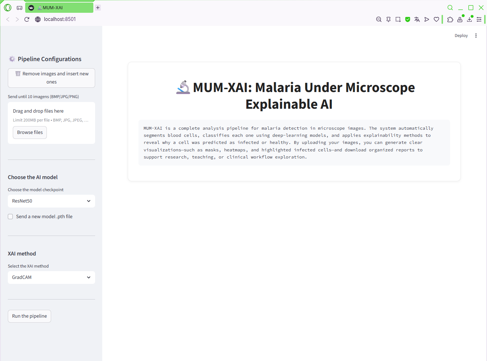
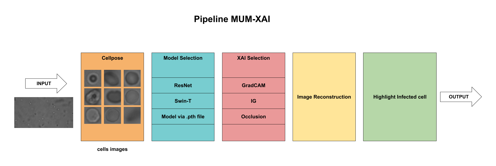

# MUM-XAI: Malaria Under the Microscope – Explainable AI

<p align="center">
  
  
  
  
  
  
  
</p>


MUM-XAI is an end-to-end, explainable artificial intelligence platform designed to support malaria diagnosis through automated microscopy analysis.  
The system integrates cell segmentation, deep-learning classification, and interpretability methods into a user-friendly Streamlit interface.


---

## 🚀 Features

### 🔬 Cell Segmentation
- Powered by **Cellpose** (generalist cell segmentation model)
- Generates instance masks and bounding boxes for each cell
- Robust to low-cost, variable-quality microscopy images

### 🤖 Deep Learning Classification
Supports two state-of-the-art architectures:
- **ResNet50** – classical convolutional neural network
- **Swin Transformer** – hierarchical vision transformer with shifted windows
- **Custom Models (.pth)** – users can upload their own trained checkpoints based on ResNet50 or Swin-T

**Model features:**

- Trained using **5-fold cross-validation**  
- Hyperparameter optimization performed with **Optuna**  
- Designed for **cell-level binary classification** (*infected* vs. *uninfected*)  
- Supports **GPU acceleration** when available  
- Allows users to **upload their own `.pth` model** directly through the Streamlit interface

### 🧠 Explainability (XAI)
Integrated post-hoc interpretability methods:
- **Grad-CAM**
- **Integrated Gradients**
- **Occlusion Sensitivity**

Each method produces visual heatmaps to help clinicians understand model decisions.


### 🌐 Streamlit Application
A graphical interface that enables:
- Uploading multiple microscopy images
- Selecting the ML model and XAI technique
- Visualizing segmentation masks, heatmaps, and highlighted infected cells
- Exporting CSV reports with per-cell predictions

#### MUM-XAI Interface

<p align="center">
  
</p>

---

##  Project Structure

```text
MUM-XAI/
├── app/
│   └── app.py                     # Streamlit interface
│
├── assets/                        # Images for README (pipeline + UI screenshot)
│   ├── mum_xai.png
│   ├── pipeline_mum-xai.png
│   └── sthe.jpg
│
├── models/                        # Pretrained model checkpoints (.pth)
│   ├── resnet_fold5.pth
│   └── swin_fold2.pth
│
├── src/                           # Main source code for the MUM-XAI pipeline
│   ├── __init__.py
│   ├── config.py                  # Global paths, device, constants
│   ├── models.py                  # ResNet50, Swin-T loading utilities
│   ├── segmentation.py            # Cellpose segmentation + cell extraction
│   ├── reconstruction.py          # Reconstruct full-image heatmaps
│   └── xai_utils.py               # Grad-CAM, IG, Occlusion wrappers
│
├── environment.yml                # Conda environment (optional)
├── requirements.txt               # Dependencies for running the Streamlit app
├── LICENSE                        # MIT License
└── README.md                      # Project documentation


```

---

## Installation

### 1. Clone the repository
```bash
git clone https://github.com/sthemonica/mum-xai
cd mum-xai
```


### 2.Create and activate a Conda environment (recommended)

```bash
conda create -n mumxai python=3.10 -y
conda activate mumxai
```

Update `pip` inside the environment (important!):

```bash
pip install --upgrade pip
```

### 3. Install dependencies

```bash
pip install -r requirements.txt
```

⚠️ **If using Anaconda**: `pip` must be called inside the environment you activated.
Otherwise, the packages will install to the wrong Python environment.
### 4. (Optional) Enable GPU acceleration

Make sure you have:

* PyTorch with CUDA

*  NVIDIA drivers and CUDA Toolkit installed

Check GPU availability:
```python
import torch
torch.cuda.is_available()
```

If your system has CUDA installed:

```bash
pip install torch torchvision torchaudio --index-url https://download.pytorch.org/whl/cu118
```

If not, the app will automatically fall back to CPU.

> If you want the complete environment that was used to train the neural network models, the `environment.yml` file contains all the necessary dependencies installed in Anaconda.

---
## ▶️ Running the Streamlit App

```bash
streamlit run app/app.py
```

The interface will open automatically in your browser at:

```arduino
http://localhost:8501
```

---
## How It Works — Pipeline Overview

<p align="center">
  
</p>


1. **Input microscopy image**

2. **Cellpose segmentation (cell masks + bounding boxes)**

3. **Extraction of individual cell crops (224×224)**

4. **Deep learning classification (ResNet50 or Swin Transformer)**

5. **XAI generation**

6. **Reconstruction of FOV with highlighted infected cells**

7. **Export of structured reports**

---
## Supported Datasets 

- **LCMG Dataset** (unstained, low-cost microscope images)

- **Lacuna Fund Malaria Detection Challenge Dataset**

All of these datasets were used, the **NIH Malaria Dataset** for training the ResNet50 and Swin Transformer networks, but MUM-XAI accepts complete images from each exam, so the LCMG and Lacuna Fund Malaria Detection Challenge datasets work correctly. You can test any dataset that has the complete image with cells.

---
## Limitations & Future Work

- Models trained only on NIH data do not generalize well to low-cost unstained images

- Needs domain adaptation or fine-tuning on LCMG data

- Future releases will include:

  - On-device inference for low-resource settings

  - Improved dataset diversity

  - Additional XAI techniques (attention rollout, SHAP)

  - Packaging as a standalone desktop/mobile application

---
## 🤝 Contributing

Contributions are welcome!
Feel free to open issues or submit pull requests for:

- New models

- Interface improvements

- Documentation updates
  
---
## 📝 License

The **source code** in this repository is licensed under the  
**Apache License 2.0**, as defined in the `LICENSE` file.

The **dissertation text, figures, and the MUM-XAI pipeline descriptions** are licensed under the  
**Creative Commons Attribution–NonCommercial–ShareAlike 4.0 (CC BY-NC-SA 4.0)** license, following the licensing terms of the official dissertation.

This dual-license structure ensures that:
- the **code remains open and reusable** for research and development, while  
- the **academic content** keeps the same protection and usage permissions defined by UTFPR.


---
## Author

<table>
  <tr>
    <td style="width: 120px;">
      
    </td>
    <td style="vertical-align: top; padding-left: 15px;">
      <p style="margin: 0; font-size: 26px; font-weight: bold;">
        Sthefanie Monica Premebida
      </p>
      <p style="margin: 4px 0; font-size: 16px;">
        MSc in Electrical Engineering – UTFPR<br>
        Research collaboration between UTFPR with Hochschule Mannheim<br>
        Focused on AI for malaria detection, explainability and low-resource medical imaging.
      </p>
    </td>
  </tr>
</table>


---
## 📚 Citation

If you use MUM-XAI in your research, please cite the corresponding dissertation:

> **Premebida, S. M. (2025). *Malaria Under the Microscope: Interpretable Deep Learning for Low-Resource Diagnostic Support*. Master’s Dissertation, Universidade Tecnológica Federal do Paraná (UTFPR).**
